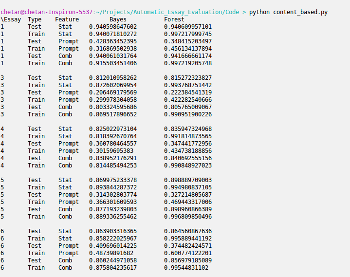
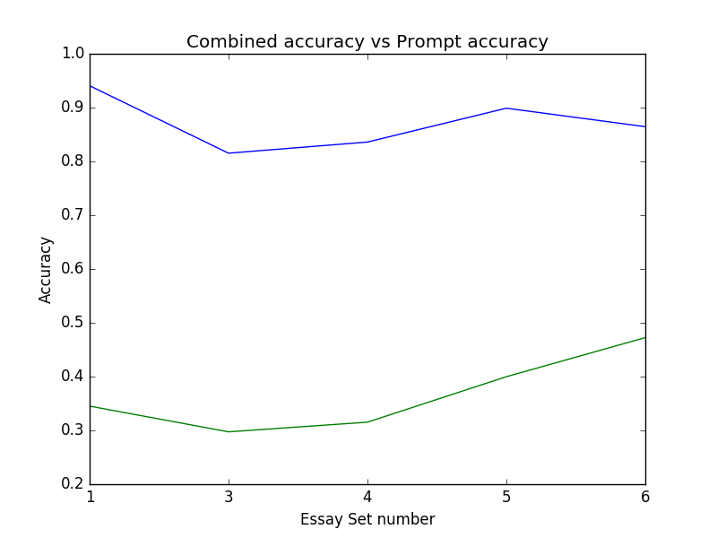
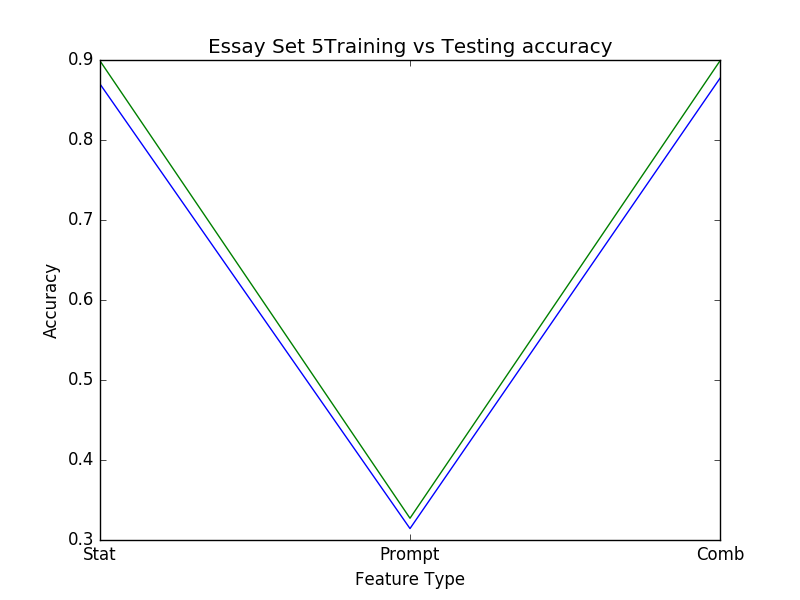
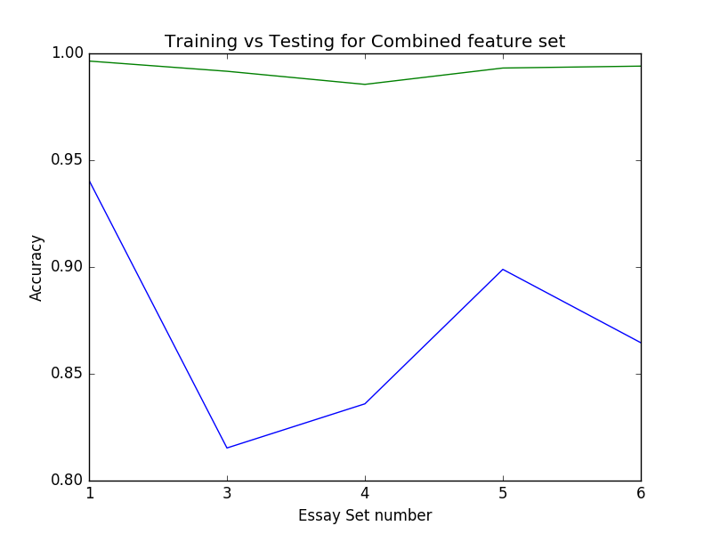

# Automatic-Essay-Evaluation
`tokenise.py` contains the code to make all statistical features.
To run the statistical model run `classisier.py`
The content based model is run from `content_based.py`
For more details read the document located at `Document/Automatic Essay Evaluation.pdf`.
The files for the content model are located in the `Experiment` folder.

